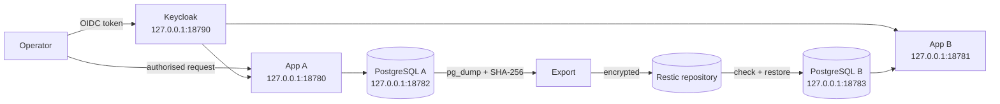

# Architecture

The demonstrator has one shared identity service and two deliberately small
application/data targets. Only one target is accepted at a time.

The measured exit is application source/configuration plus synthetic
PostgreSQL data from A to B. Keycloak stays shared during that measurement.
Identity export, issuer rotation and MFA re-enrolment are therefore separate
work, not hidden inside the result.

On CT109 all listeners use host networking and bind explicitly to loopback.
This avoids modifying the shared host firewall after its Docker bridge pool
and forwarding state prevented traffic on a new bridge. A new deployment may
choose private bridges after its own network test, but must retain the
loopback-only public boundary for this lab.
